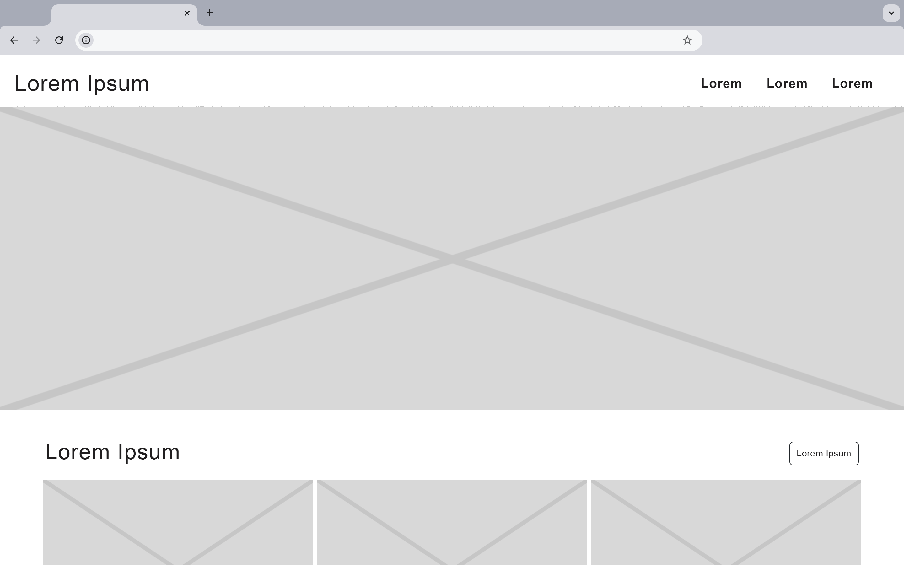
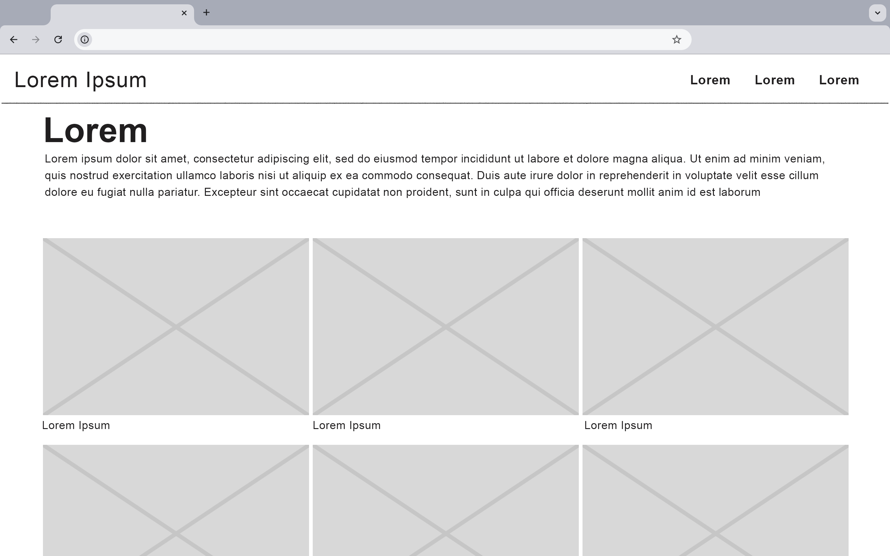
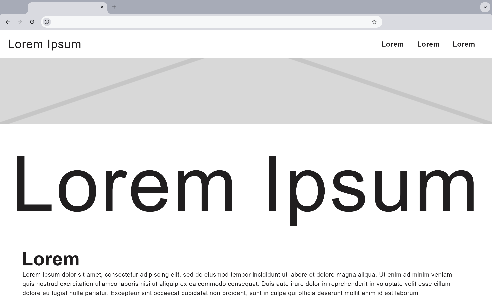

# Animal Photographer Portfolio

## Description

A Fictional Animal Photography Experience

Dive into a world of imaginative wildlife photography, where every image tells a story crafted from the stunning and diverse free pictures available on Unsplash. Though this site is a work of fiction, it brings to life a captivating narrative through the lens of a fictional animal photographer.

Each photograph on this site has been carefully selected from Unsplash’s extensive collection to create a visually compelling experience. While the scenarios are imagined, the beauty and artistry of these images are very real.

Enjoy this fictional journey through nature’s wonders and let your imagination roam free as you explore the visual storytelling of a fictional animal photographer.

### Screen Shots

### Technologies Used

- Html
- CSS
- Bootstrap

### User Stories

1. As a user, I want to view a gallery of images on a page so that I can browse through the stunning animal photographs displayed on the website.
2. As a user, I want to see an image from the gallery along with additional details or a description.
3. As a user, I want to fill out a contact form with my name, email, and message so that I can send an inquiry or feedback to the website owner.

### Wireframe

### Next Steps

1. Enable users to curate their own galleries by marking images as favorites, creating collections, and saving their preferred images for easy access.
2. Optimize image loading with techniques like lazy loading and efficient image formats to enhance site performance.
3. Add a search bar that allows users to search for specific images or keywords, improving navigation and making it easier to find specific content within the gallery.

## Author

Ayodeji Taiwo - [@Linkedin](https://www.linkedin.com/in/taiwo-a-80346223b/)
